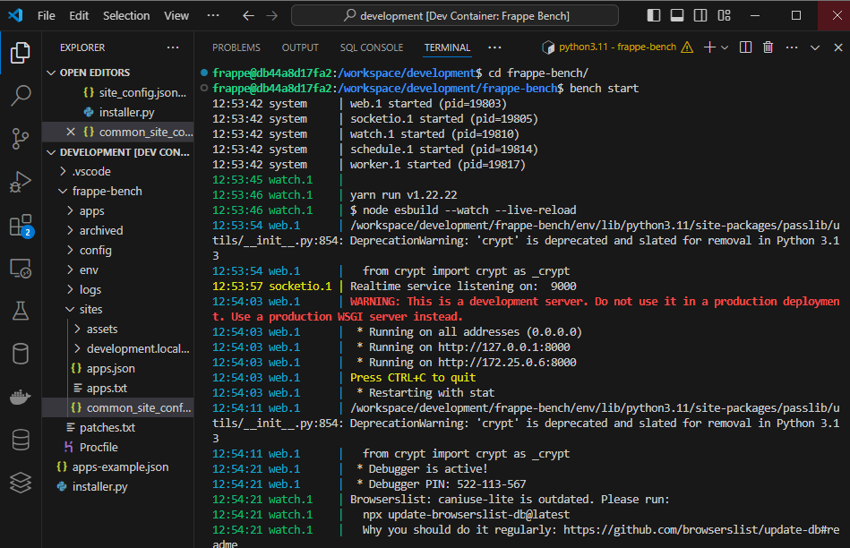

# frappe-framework
frappe framework dev environment from [frappe docker repository](https://github.com/frappe/frappe_docker)

prerequisites:
 - [Docker](https://docs.docker.com/get-docker/)
 - [docker-compose](https://docs.docker.com/compose/)
 - [git](https://docs.github.com/en/get-started/getting-started-with-git/set-up-git)
 - [VSCode editor](https://code.visualstudio.com/download)
 - [VSCode Dev Containers extension](https://marketplace.visualstudio.com/items?itemName=ms-vscode-remote.remote-containers)
 - [VSCode Docker extension](https://marketplace.visualstudio.com/items?itemName=ms-azuretools.vscode-docker)
 - [VSCode Datanase client](https://marketplace.visualstudio.com/items?itemName=cweijan.vscode-database-client2)

VSCode should automatically inquire you to install the required extensions, that can also be installed manually as follows:

- Install Dev Containers for VSCode
  - through command line `code --install-extension ms-vscode-remote.remote-containers`
  - clicking on the Install button in the Vistual Studio Marketplace: [Dev Containers](https://marketplace.visualstudio.com/items?itemName=ms-vscode-remote.remote-containers)
  - View: Extensions command in VSCode (Windows: Ctrl+Shift+X; macOS: Cmd+Shift+X) then search for extension `ms-vscode-remote.remote-containers`

After the extensions are installed, you can:

- Open frappe_docker folder in VS Code.
  - `code .`
- Launch the command, from Command Palette (Ctrl + Shift + P) `Dev Containers: Reopen in Container`. You can also click in the bottom left corner to access the remote container menu.

The VSCode Dev Container extension will automatically initiate the deployment of a default site named "development.localhost". Please be patient during this process, as it may take some time. Once deployment is complete, you can begin Frappe development by running the bench start command in the /workspace/development/frappe-bench directory.

Open the default site on [localhost:8000](http://localhost:8000)

⚠️ default credentials:
  - login: administrator
  - password: admin
